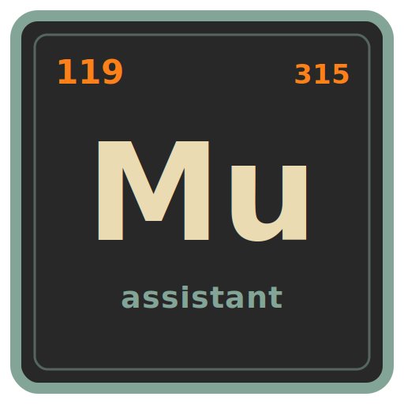

# mu

<p align="center">
  
</p>

`mu` is a programmable personal assistant for technical work, designed for long-running execution, persistence, and reactivity.

Where other agents bake in complex logic, `mu` provides modular CLI primitives (issue tracking, heartbeats, programmable HUDs) that agents orchestrate using shell commands. This makes `mu` highly customizable: as [Mario](https://mariozechner.at/posts/2025-11-30-pi-coding-agent/) and [Armin](https://lucumr.pocoo.org/2026/1/31/pi/) note, *bash is all you need*.

## Quickstart

Install `mu` globally via npm:

```bash
npm install -g @femtomc/mu
```

`mu` requires an AI model to function. Export your API key before starting. `mu` supports multiple models; export the one(s) you intend to use:

```bash
export ANTHROPIC_API_KEY="sk-ant-..."
export OPENAI_API_KEY="sk-proj-..."
export GOOGLE_API_KEY="AIza..."
```

Start the `mu` server and attach a terminal operator session in your repository:

```bash
cd /path/to/your/repo
mu serve
```

In a separate terminal, use the CLI to interact with the assistant's state:

```bash
mu status --pretty
mu control harness --pretty
mu issues ready --pretty
mu forum post research:topic -m "found something" --author operator
mu memory search --query "reload" --limit 20
```

## Key Features

`mu` extends the [`pi`](https://github.com/badlogic/pi-mono) framework with programmable batteries:

- **CLI issue tracker & forum**: Native tools to manage work and discussions (inspired by [beads](https://github.com/steveyegge/beads)).
- **Heartbeats & crons**: Durable automation loops for long-running tasks (inspired by [openclaw](https://github.com/openclaw/openclaw)).
- **Programmable HUD**: Real-time contextual display updated dynamically by the agent.
- **Skill-based behavior**: Customize agent workflows entirely through Markdown files.

## Skills

Skills define the agent's behavior. Because `mu` relies on bash and CLI tools, you customize skills to change workflows. `mu` ships with a set of version-synced starter skills bootstrapped into `~/.mu/skills/`:

- **Core**: `mu` (CLI usage), `memory` (context retrieval)
- **Planning**: `planning` (issue DAGs), `hud` (HUD contract), `orchestration` (DAG protocol), `control-flow` (loop policies), `subagents` (durable orchestration)
- **Sessions**: `code-mode` (REPLs), `tmux` (workspace fan-out)
- **Automation**: `heartbeats` (lifecycle automation loops), `crons` (wall-clock scheduling)
- **Messaging Setup**: `setup-slack`, `setup-discord`, `setup-telegram`, `setup-neovim`
- **Writing**: `writing` (technical prose guidelines)

**Usage pattern:** Ask the agent to use a specific skill. For example: *"Can we plan and setup an implementation issue DAG?"* or *"Set up the slack messaging service."*

### Skill Precedence

When names collide, `mu` loads the first match in this order:
1. Workspace: `~/.mu/workspaces/<workspace-id>/skills/`
2. Global: `~/.mu/skills/`
3. Repository: `skills/`
4. Pi framework (also loaded): `.pi/skills/`, `~/.pi/agent/skills/`

## Messaging Adapters

`mu` supports native integrations via agent-first setup skills. The agent patches configuration, reloads the control plane, verifies capabilities, and guides you through required setup.

Manage the control plane with:

```bash
mu control status --pretty
mu store paths --pretty
mu control reload
mu control identities --all --pretty
```

*Detailed adapter internals are available in the [control-plane](packages/control-plane/README.md), [server](packages/server/README.md), and [neovim](packages/neovim/README.md) package docs.*

## Terminal Operator Sessions

Manage interactive sessions using the CLI:

```bash
mu session list --json --pretty
mu session list --kind cp_operator --json --pretty
mu session list --kind all --all-workspaces --limit 50 --json --pretty
mu session <session-id>
mu turn --session-kind operator --session-id <session-id> --body "follow-up"
```

## Packages

| Package | Description |
|---------|-------------|
| [`@femtomc/mu-core`](packages/core/README.md) | Types, JSONL persistence, IDs, and event primitives. |
| [`@femtomc/mu-agent`](packages/agent/README.md) | Agent runtime primitives, prompt/skill loading, and operator integration. |
| [`@femtomc/mu-control-plane`](packages/control-plane/README.md) | Messaging control-plane runtime (Slack/Discord/Telegram/Neovim adapters). |
| [`@femtomc/mu-issue`](packages/issue/README.md) | Issue DAG store and lifecycle operations. |
| [`@femtomc/mu-forum`](packages/forum/README.md) | Topic-keyed forum message store. |
| [`@femtomc/mu`](packages/cli/README.md) | Bun CLI and programmatic entrypoint. |
| [`@femtomc/mu-server`](packages/server/README.md) | HTTP API server + control-plane/runtime coordination surfaces. |
| [`mu.nvim`](packages/neovim/README.md) | First-party Neovim frontend channel. |

*When installed from npm, READMEs exist at `<mu-install>/node_modules/@femtomc/mu-<package>/README.md`.*

## Development

`mu` requires [Bun](https://bun.sh) for local development, while Node.js (`npm`) is sufficient for global runtime usage.

Set up the environment:

```bash
bun install
bun run check
```

Validate and test changes:

```bash
bun run guardrails:architecture
bun run guardrails
bun run typecheck
bun test
bun run fmt
bun run lint
bun run pack:smoke
```

## Workspace Store & Troubleshooting

Runtime state is strictly workspace-scoped. Data is stored under:

- `~/.mu/workspaces/<workspace-id>/`
- or `$MU_HOME/workspaces/<workspace-id>/`

To find exact paths for the current repository:

```bash
mu store paths --pretty
```

To wipe the state for a specific project and start fresh, safely delete its workspace directory:

```bash
rm -rf ~/.mu/workspaces/<workspace-id>
```